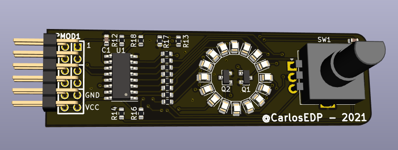
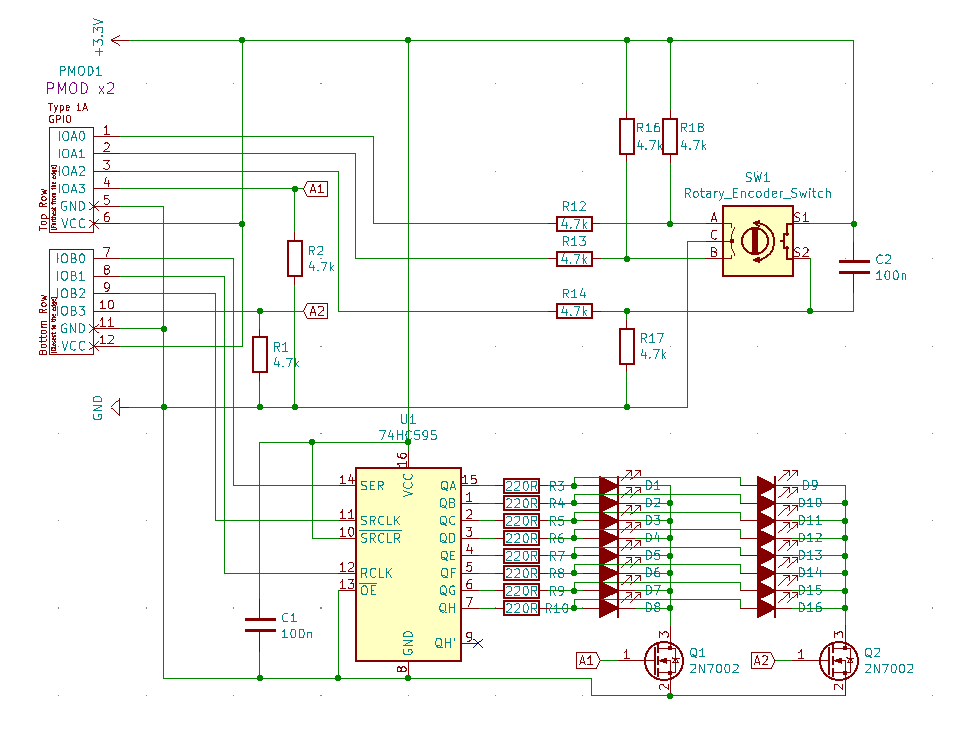

# PMOD1 - RingPush module

This repository hosts all data related to PMOD1, a PMOD module with a LED ring and a rotary encoder with push button. Always use the latest version of the PCB.

## PCB 3D View:

## Schematic

## BOM

Id|Designator|Package|Quantity|Designation|
----|------------|---------|----------|-------------|
1|U1|SOIC-16_3.9x9.9mm_P1.27mm|1|74HC595|||
2|PMOD1|pmod_pin_array_6x2|1|PMOD-Device-x2-Type-1A-GPIO|||
3|SW1|RotaryEncoder_Alps_EC11E-Switch_Vertical_H20mm|1|Rotary_Encoder_Switch|||
4|R1,R2,R12,R13,R14,R16,R17,R18|R_0603_1608Metric_Pad0.98x0.95mm_HandSolder|8|4.7k|||
5|C1,C2|C_0603_1608Metric_Pad1.08x0.95mm_HandSolder|2|100n|||
6|D1,D2,D3,D4,D5,D6,D7,D8,D9,D10,D11,D12,D13,D14,D15,D16|LED_0805_2012Metric_Pad1.15x1.40mm_HandSolder|16|LED_ALT|||
7|R3,R4,R5,R6,R7,R8,R9,R10|R_0603_1608Metric_Pad0.98x0.95mm_HandSolder|8|220R|||
8|Q1,Q2|SOT-23|2|2N7002|||

The repository has the following data:

* Kicad project with [schematic and PCB](Kicad-RingPush)
* [Arduino sample](arduino/RingLed/RingLed.ino) implemented on the NodeMCU board showing the encoder and rindLED functionality
